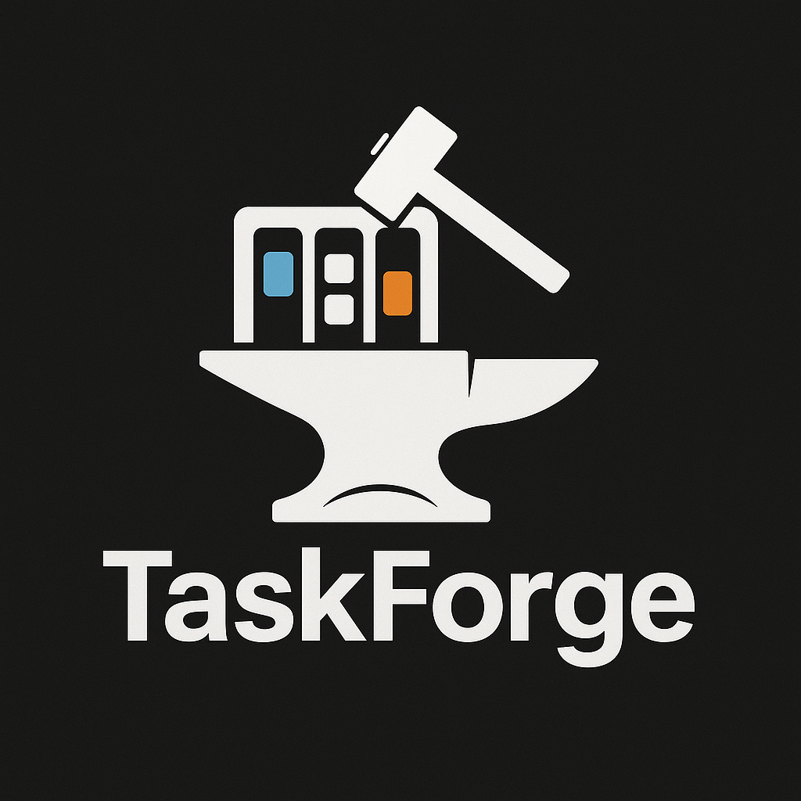

<h1></h1>

### Summary:

---

Task Forge is a lightweight KanBan Board web application for task organization and tracking. Designed in the vein of popular project management tools such as Jira and Trello. the frontend was built using the React.js with Vite, the backend was constructed using Node.js and Express.js and includes a SQLite database for persistence.

### Features

---

- User login with session based authentication (express-sessions).
- User registration with user data persisted to database.
- Task creation with database persistence.
- Task update and delete functionality via CRUD API.
- Responsive design desktop/mobile.
- Data base persistence wtih better-sqlite3.
- Drag and Drop functionality to move tasks between progression stages. (Please note that I had given up on adding this feature initially due to the complexity of integrating it at late stage in development. However, Craig Geil was able to show me how to do it with relative ease. So I do NOT claim credit for this feature or the associated code.)

### CapStone Requirements Met

---

- [x] Detailed README w/run instructions
- [x] Visually appealing
- [x] 10+ distinct commits to github repo via console commands
- [x] Responsive design - mobile/desktop views
- [x] Created an Internal API
- [x] Use a regular expression to validate user data (username)
- [x] Visualize data in a user friendly way (Task Cards)
- [x] Create a node.js web server with express.js
- [x] Interact with SQlite database to store and retrieve information
- [x] implemented drag and drop functionality
- [x] developed frontend UI with React.js

### Installation and Operation

---

To run this application locally, you can clone the project to a directory of your choosing.
In your terminal, navigate to said directory and run the following command.

```
git clone https://github.com/AASierp/WebDev_CapStone.git
```

From here, open the directory in Visual Studio or your preferred development environment.
In the terminal once more, change directory(cd) into _taskforge/client_ and run:

```
npm install
```

this will install all necessary dependencies as outlined in the package.json file

Once complete, perform the same operation but this time in the _taskforge/server_ directory.

You are now ready to run the program.

while still in the server directory, in the terminal, run:

```
npm run dev
```

This should start the backend server and you should see the following in the console:

```
[nodemon] 3.1.10
[nodemon] to restart at any time, enter `rs`
[nodemon] watching path(s): *.*
[nodemon] watching extensions: js,mjs,cjs,json
[nodemon] starting `node server.js`
Server listening on 3000
```

(interesting side note: this also causes the creation of the database file if it did not already exist. You can delete it and run this again if you wish to see it happen - _taskforge/server/db/taskforge.db_)

Now, _**IN A NEW TERMINAL**_, change directories back to _taskforge/client_ and run the same command there.

you should see the following:

```
VITE v7.0.0  ready in 241 ms

  ➜  Local:   http://localhost:5173/
  ➜  Network: use --host to expose
  ➜  press h + enter to show help
```

---

(PLEASE NOTE: if the above states that the service has been started on a port other than 5173, you will run into issues. This will only happen if port 5173 happens to already be in use. If this does occur, you will need to adjust the CORS origin setting in taskforge/server/server.js file) simply change the origin port number to match the port that vite failed over to. SEE BELOW -

```
app.use(
  cors({
    origin: "http://localhost:6173", // SET THIS TO DESIRED PORT NUMBER
    credentials: true, // allows cookies/sessions to work across requests
  })
```

---

Now, hover over the `http://localhost:6173/` address and click the "follow link" hypertext.
In lieu of this, you can also visit that address manually in your browser.

At this point, you should be able to test the application at your leisure. I recommend:

1. Registering a new user

2. Logging in

3. Creating, updating, and deleting a few tasks

4. Dragging and dropping tasks between columns

5. Logging out

If you have a SQLite database viewer installed (I use DB Browser for SQLite), you can also observe changes in real time as you test functionality.

### AI USAGE

---

I heavily utilized Chatgpt in implementing and understanding 'session' state and persistence.
Not a direct cut and paste but definitely a step by step explanation with directions on implementation.

### Reflection

---

If I had the choice to make again, I may have opted for vanilla js for the UI rather than dive headlong into attempting to learn React. I feel that I spent SO much time watching tutorials and reading documentation (and rewatching/rereading), that I could have produced a far more impressive application in the same amount of time had I used something I already had a bit of familiarity with. Also, the choice to use React deprived me of getting additional practice with DOM manipulation, which is something I feel I need. On the positive side, React is a high demand skill and now that I have had an introduction to it, I will likely use it again in future project to further hone my skill.

### Future Improvements

---

Eventually, I hope to create an expanded version that will be a kind of "life management" application; which I intend on rebranding as "LifeForge". Ideally, it will include a wide range of features, everything from budgeting to meal prep. Although, before I get to all of that, I think I probably need to do a bit better job modularizing the program as it exists at the moment, as well as be a little more diligent and less vague in my error handling. Also, early on I was really on top of commenting my code. I let that slip quite a lot, as time went on. I will attempt to complete commenting the code in the near future.
